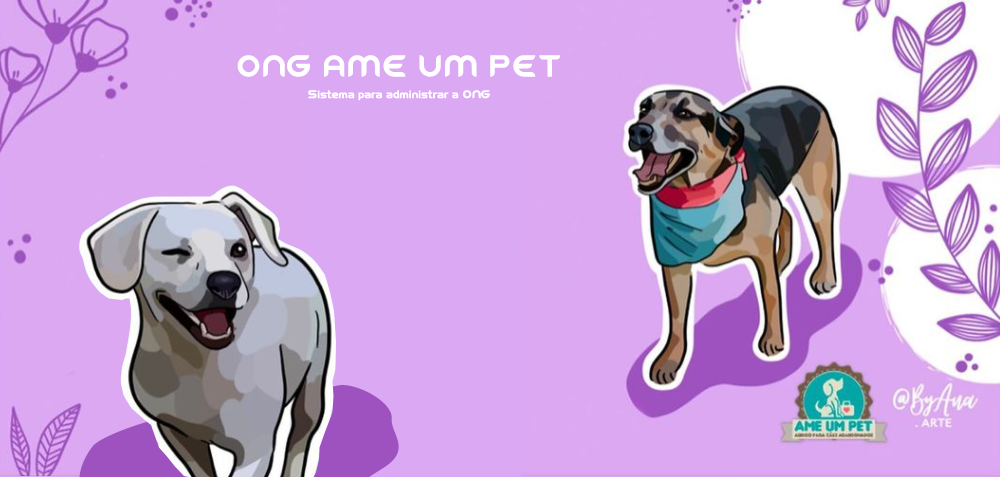

<h1 align="center">
    
</h1>

<h4 align="center"> 
	🚧 ONG AUP 1.0 em construção... 🚧
</h4>

<p align="center">
  

  
  
  <a href="https://github.com/vseeberger/ong-aup-frontend/commits/master">
    
  </a>

  
   <a href="https://github.com/vseeberger/ong-aup-frontend/stargazers">
    
  </a>
</p>

## 💻 Sobre o projeto

♻️ É um sistema para gestão do Abrigo fazendo o controle de pedidos para compra, animais, medicamentos, rações, etc.

As ONGs ou protetores e protetoras independentes poderão se cadastrar na plataforma web para fazer o uso do sistema de forma gratuíta.

## 🎨 Layout

O layout da aplicação está disponível no Figma:

<!-- <a href="https://www.figma.com/file/1SxgOMojOB2zYT0Mdk28lB/Ecoleta?node-id=136%3A546">
  
</a> -->


<!-- ### Mobile

<p align="center">
  

  
</p>
-->

### Web

<p align="center" style="display: flex; align-items: flex-start; justify-content: center;">
  

  
</p>

## 🛠 Tecnologias

As seguintes ferramentas foram usadas na construção do projeto:

- [.Net Core][.netcore]
- [Angular][angular]
- [TypeScript][typescript]


<!-- ## 🚀 Como executar o projeto

Podemos considerar este projeto como sendo divido em três partes:
1. Back End (pasta server) 
2. Front End (pasta web)
3. Mobile (pasta mobile)

💡Tanto o Front End quanto o Mobile precisam que o Back End esteja sendo executado para funcionar.

### Pré-requisitos

Antes de começar, você vai precisar ter instalado em sua máquina as seguintes ferramentas:
[Git](https://git-scm.com), [Node.js][nodejs]. 
Além disto é bom ter um editor para trabalhar com o código como [VSCode][vscode]

### 🎲 Rodando o Back End (servidor)

```bash
# Clone este repositório
$ git clone https://github.com/tgmarinho/nlw1

# Acesse a pasta do projeto no terminal/cmd
$ cd nlw1

# Vá para a pasta server
$ cd server

# Instale as dependências
$ npm install

# Execute a aplicação em modo de desenvolvimento
$ npm run dev:server

# O servidor inciará na porta:3333 - acesse http://localhost:3333 
```

### 🧭 Rodando a aplicação web (Front End)

```bash
# Clone este repositório
$ git clone https://github.com/tgmarinho/nlw1

# Acesse a pasta do projeto no seu terminal/cmd
$ cd nlw1

# Vá para a pasta da aplicação Front End
$ cd web

# Instale as dependências
$ npm install

# Execute a aplicação em modo de desenvolvimento
$ npm run start

# A aplicação será aberta na porta:3000 - acesse http://localhost:3000
```

### 📱Rodando a aplicação mobile 

🚧 Em construção... 🚧
-->
## 😯 Como contribuir para o projeto

1. Faça um **fork** do projeto.
2. Crie uma nova branch com as suas alterações: `git checkout -b my-feature`
3. Salve as alterações e crie uma mensagem de commit contando o que você fez: `git commit -m "feature: My new feature"`
4. Envie as suas alterações: `git push origin my-feature`
> Caso tenha alguma dúvida confira este [guia de como contribuir no GitHub](https://github.com/firstcontributions/first-contributions)


## 📝 Licença

Este projeto esta sobe a licença MIT.

Feito por Valter Furtado Seeberger 👋🏽 [Entre em contato!](https://www.linkedin.com/in/valter-seeberger/)

<!-- [nodejs]: https://nodejs.org/ -->
[typescript]: https://www.typescriptlang.org/
<!-- [expo]: https://expo.io/ -->
<!-- [reactjs]: https://reactjs.org -->
<!-- [rn]: https://facebook.github.io/react-native/ -->
<!-- [yarn]: https://yarnpkg.com/ -->
[vscode]: https://code.visualstudio.com/
[vceditconfig]: https://marketplace.visualstudio.com/items?itemName=EditorConfig.EditorConfig
[license]: https://opensource.org/licenses/MIT
[vceslint]: https://marketplace.visualstudio.com/items?itemName=dbaeumer.vscode-eslint
[prettier]: https://marketplace.visualstudio.com/items?itemName=esbenp.prettier-vscode
<!-- [rs]: https://rocketseat.com.br -->
